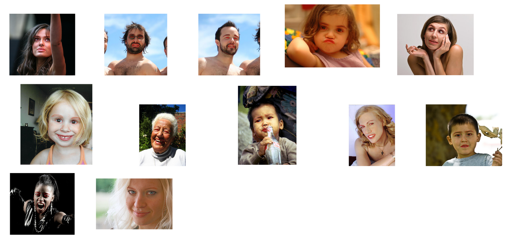
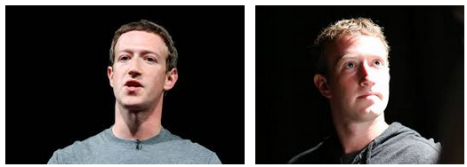
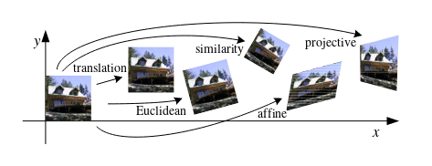
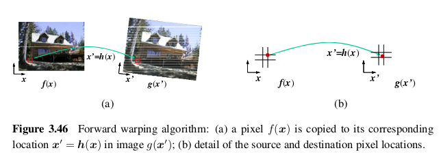
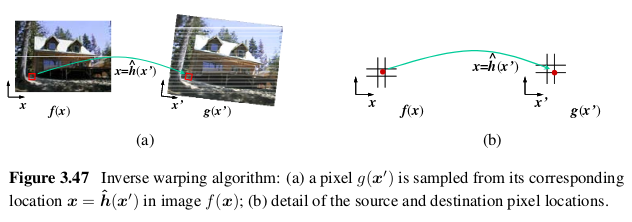
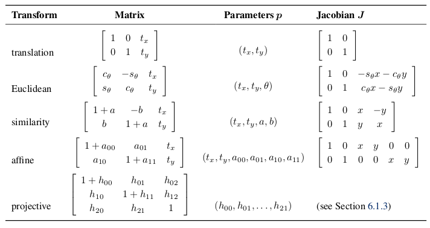

# Using **Face Landmarks** in Face Pose Predictor and Aligner

## Source

[[Paper]Rapid Object Detection using a Boosted Cascade of Simple Features - Paul Viola and Michael Jones - 2001](https://www.cs.cmu.edu/~efros/courses/LBMV07/Papers/viola-cvpr-01.pdf).

[[Book]Computer Vision: Algorithms and Applications - Richard Szeliski - Springer - 2010](http://szeliski.org/Book/)

[[Paper]Constrained Local Neural Fields for robust facial landmark detection in the wild - Tadas Baltrusaitis, Peter Robinson, and Louis-Philippe Morency - 2013](https://www.cl.cam.ac.uk/~tb346/pub/papers/iccv2013.pdf)

[[Paper]Facial Landmark Detection by Deep Multi-task Learning - Zhanpeng Zhang, Ping Luo, Chen Change Loy, and Xiaoou Tang - 2014](http://personal.ie.cuhk.edu.hk/~ccloy/files/eccv_2014_deepfacealign.pdf).

[[Paper]One Millisecond Face Alignment with an Ensemble of Regression Trees - Vahid Kazemi and Josephine Sullivan - Royal Institute of Technology, Stockholm, Sweden](http://www.csc.kth.se/~vahidk/papers/KazemiCVPR14.pdf).

[[Wiki]Affine Transformation](https://en.wikipedia.org/wiki/Affine_transformation).

[[Blog]Dlib's Real-Time Face Pose Estimation - Davis King - 2014](http://blog.dlib.net/2014/08/real-time-face-pose-estimation.html).

### Datasets and Pre-trained Models

[Labeled Face Parts in the Wild (LFPW) Dataset - Kriegman-Belhumeur Vision Technologies, LLC](https://neerajkumar.org/databases/lfpw/).

[Helen dataset](http://www.ifp.illinois.edu/~vuongle2/helen/).


 
### Libraries and Examples

[Dlib](http://dlib.net/) and its [Python binding](https://pypi.python.org/pypi/dlib).

[OpenFace](https://cmusatyalab.github.io/openface/).

[Adam Geitgey's Blog: Modern Face Recognition with Deep Learning - Finding, posing and projecting faces](https://medium.com/@ageitgey/machine-learning-is-fun-part-4-modern-face-recognition-with-deep-learning-c3cffc121d78).

## Details

### Vấn đề



Với con người, thật quá dễ dàng để nhận thấy rằng, cả hai khuôn mặt trong bức ảnh trên đều thuộc về một người.

Tuy nhiên, với máy tính, sẽ tự động cho rằng **hai khuôn mặt trên là hai con người khác nhau**.

Vì vậy, một tiền xử lý dữ liệu là cần thiết ([OpenFace's Docs](http://openface-api.readthedocs.io/en/latest/openface.html#openface-aligndlib-class)) để giải quyết vấn đề này và phải thực hiện ngay sau khi chúng ta đã cô lập được các khuôn mặt ra khỏi ảnh.

### Hướng tiếp cận

Để giải quyết vấn đề này, suy nghĩ đơn giản nhất là "đưa các bộ phận đặc trưng (mắt, mũi, miệng, ...) luôn nằm ở một vị trí cố định".

### Face Landmarks and Pose Predictor

Face Landmark hay "các điểm đặc trưng trên khuôn mặt" là một trong những thành phần cơ bản của những tác vụ liên quan đến "khuôn mặt con người" như: nhận diện khuôn mặt, sinh trắc học, v.v...

Theo thông thường, việc nhân diện các điểm đặc trưng này là vấn đề độc lập. Những cách thông thường để giải quyết vấn đề này thường là phép đối chiếu trên từng các khuôn mẫu (template) hoặc trên dựa trên phân tích hồi quy. Ví dụ, Sun et al. có đưa ra [phương pháp](https://www.cv-foundation.org/openaccess/content_cvpr_2013/papers/Sun_Deep_Convolutional_Network_2013_CVPR_paper.pdf) nhận diện các điểm đặc trưng trên khuôn mặt sử dụng coarse-to-fine (từ thô đến mịn?) phân tích hồi quy sử dụng một mạng nơ-ron tích chập. Phương pháp này đã đạt được kết quả rất cao so với những phương pháp trước đó và đã được áp dụng trong các hệ thống thương mại. Phương pháp này yêu cầu một lượng lớn và phức tạp các mô hình thác nước trong mạng ẩn.

Trong một số báo cáo khoa học, nhiều nhà khoa học máy tính cho rằng đây không phải là vấn đề độc lập, và rõ ràng kết quả của kỹ thuật hoàn toàn có thể bị ảnh hưởng bởi những yếu tố tương quan nhỏ và không đồng nhất (heterogeneous and subtly correlated factors). Ví dụ như, khi một đứa bé cười, miệng nó mở to, rõ ràng rằng nếu chúng ta nắm được các thông tin về cảm xúc cũng như là đặc điểm khuôn mặt thì việc định dạng các điểm đặc trưng sẽ chính xác hơn rất nhiều.

#### Landmark detection bằng CNN

Sun el at. đã được ra phương pháp sử dụng mạng CNN nhiều tầng. Phương pháp này yêu cầu phải có tập huấn luyện gồm các khuôn mặt đã được tách biệt ra thành các bộ phận riêng biệt, và mỗi bộ phận được xử lý bởi một mạng CNN riêng biệt cho riêng phần đấy.

### 2D feature-based alignment

#### Parametric transformations

Phép biến đổi tham số (parametric transformation) sẽ tạo sự biến dạng trên toàn bộ bức ảnh, mà trong đó, kết quả của sự biến đổi phụ thuộc vào tập giá trị hữu hạn các tham số.



Trong bức ảnh trên là một số ví dụ trực quan về các phép biến đổi tham số hai chiều thường được sử dụng.

```python
    # Example

    # image_f is input, image_g is excepted output and h is transform function
    def forward_mapping(image_f, h, image_g):
        width, height = image_f.shape[;;2]
        for x in range(0, width):
            for y in range(0, height): # For every pixels in the image f
                new_x, new_y = h(x, y) # Compute the new destination location
                image_g[new_x][new_y] = image_f[x][y] # Copy pixel from f to g

```


```python
    #Example

    # image_f is input, image_g is excepted output and h is transform function
    def inverse_wrapping(image_f, h, image_g):
        width, height = image_g.shape[;;2]
        for x in range(0, width):
            for y in range(0, height): # For every pixels in the image g
            source_x, source_y = h(x, y) # Compute the source location
            g[x][y] = f[source_x][source_y] # Resample and copy to image_g 

```


### Affine Transformation

